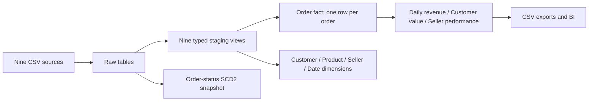

# Commerce Analytics Warehouse

[](https://github.com/Raveesh-rajg/dbt-snowflake-ecommerce/actions/workflows/dbt_ci.yml)

**A runnable e-commerce warehouse with trustworthy revenue, customer and seller metrics.**
Nine Olist-shaped sources become 17 documented dbt models, three analysis marts,
and an order-status SCD2 snapshot. Anyone can build and test it locally without
an account, credentials, downloads or cloud spend.

**Status:** Local implementation verified on synthetic edge-case data. Snowflake
profile and loading path supplied; a live Snowflake run, full Olist-data validation
and Tableau publication have **not** been performed. This project does not claim
production deployment, measured Snowflake cost savings, or a finished Tableau dashboard.

## Run in five minutes

Python 3.12 is tested. From the repository root:

```bash
python -m venv .venv
# macOS/Linux:
source .venv/bin/activate
# Windows PowerShell instead: .venv\Scripts\Activate.ps1
python -m pip install -r requirements.txt
python scripts/run_demo.py
python -m pytest -q
```

`run_demo.py` generates a deterministic fixture, transactionally loads nine raw
tables into `data/olist.duckdb`, runs the **entire** dbt build (including all data
tests and the snapshot), generates dbt documentation, and exports three marts.
The demo writes only under this checkout and replaces its local demo inputs.
Use `scripts/load_local.py` separately for your own data.

```bash
dbt docs serve --profiles-dir profiles --target local --port 8080
```

Open the local documentation to inspect descriptions, columns and lineage.
CSV extracts appear in `data/exports/`; connect one mart per Tableau/Power BI page
to preserve the intended grain. [Example queries](analyses/business_questions.sql)
answer revenue, customer concentration and seller quality questions directly.

## What the demo proves

These are **synthetic fixture results**, not findings about Brazilian commerce:

| Check | Verified result |
|---|---|
| Full build | 17 models + 1 snapshot; 73 passing dbt data tests |
| Behavioral regressions | 9 passing Python integration tests |
| Order coverage | 12 orders: 9 delivered, 2 canceled, 1 shipped |
| Delivered order value | BRL 803.00, reconciled independently to source items + freight |
| Calendar | 45 contiguous days, including zero-order days |
| Repeat customer moving states | One customer row; 3 delivered orders; BRL 308.00 |
| Multi-item / multi-review / split-payment order | BRL 165.00, without multiplying revenue |
| Seller delivery rate | 50% on time among 8 orders with observed delivery comparisons |

[Validation record](docs/VALIDATION.md) explains the tests, boundaries and commands.
CI repeats the full build and regression suite on every push and pull request,
without secrets; dbt artifacts and CSV exports are attached to the workflow run.

## Architecture and grain



| Model | Grain and use |
|---|---|
| `fct_orders` | One order, all statuses; item, payment and review aggregates joined safely |
| `dim_customers` | One stable `customer_unique_id`; latest observed location |
| `dim_products` / `dim_sellers` | One entity, including entities without delivered sales |
| `dim_dates` | One calendar date between first and last source purchase |
| `mart_daily_revenue` | One calendar date; delivered order value and 7/30-calendar-day windows |
| `mart_customer_lifetime_value` | One stable customer with delivered orders; historical value, not a CLV prediction |
| `mart_seller_performance` | One seller with delivered sales; order-weighted service metrics |

## Definitions that prevent misleading numbers

- All money is **BRL**. Order value is item price plus freight; it is not net
  profit, refund-adjusted revenue or platform commission.
- Financial marts include **delivered orders**. `orders_count` counts all statuses;
  `delivered_orders` is the denominator for delivered-order average order value.
- Payments are a separate measure. They are not forced to equal item value.
- Reviews are averaged once per order before seller/customer aggregation. An
  order-level review is not evidence about an individual product or seller alone.
- On-time rate excludes unknown delivery/estimate pairs; it never treats missing
  delivery as success. Early delivery retains a negative `days_vs_estimate`.
- Customer identity uses `customer_unique_id`, not the per-order customer key.
- Daily distinct customers are **not additive** over dates; period-level distinct
  customers must be recomputed from `fct_orders`.
- Rolling averages include zero-sales days; initial windows use available days.
  The daily mart deliberately rebuilds the complete short calendar, so corrections
  older than 30 days are reflected without an incremental cutoff.

See [design decisions](docs/DECISIONS.md), [quality findings](docs/DATA_QUALITY_FINDINGS.md),
and the [Snowflake/full-data runbook](docs/RUNBOOK.md).

## Source data

The warehouse follows the [Brazilian E-Commerce Public Dataset by Olist](https://www.kaggle.com/datasets/olistbr/brazilian-ecommerce).
Obtain the nine original CSV files from that source and observe its license.
The repository includes a synthetic generator, **not** a redistributed copy of
the Olist dataset. Fixture results cannot establish full-dataset quality or performance.

## Repository

```text
models/staging/     9 cleaned source views and source contracts
models/marts/       4 dimensions, order fact, 3 marts
models/schema.yml   grain, documentation and model tests
snapshots/         order-status history with environment-isolated schema
tests/             SQL reconciliation and business checks
tests_python/      executable regression tests
scripts/           fixture, local/Snowflake loaders, demo and BI exports
profiles/          credential-free dbt profiles
analyses/          decision-oriented example queries
docs/              modeling decisions, quality findings and operating instructions
```
